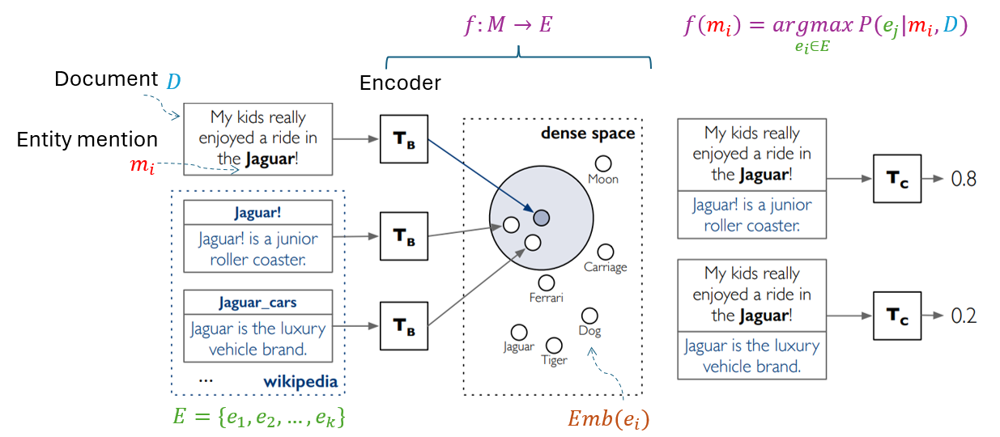

# LLM-guided Bio Named Entity Normalisation

## Named-Entity Normalisation
The task of **Named Entity Normalization (Entity Linking)** is defined as follows:

- Let $D$ be a document containing a set of entity mentions $M = \{m_1, m_2, \dots, m_n\}$, where each $m_i$ is a surface form (e.g., a name, organization, or location).

- Let $E = \{ e_1, e_2, \dots, e_k \}$ be a set of entities in a knowledge base $K$, where each entity \$e_i$ has a unique identifier (e.g., Wikipedia ID, Wikidata QID).

The goal of **Entity Linking** is to find a mapping function $f: M \rightarrow E$, such that for each entity mention $m_i \in M$, the function $f$ assigns the correct entity $e_j \in E$ from the knowledge base.

$$f(m_i) = \arg\max_{e_j \in E} P(e_j | m_i, D)$$

where $P(e_j | m_i, D)$ represents the probability of entity $e_j$ being the correct entity for mention $m_i$ given the document context $D$.

The objective is to maximize this probability to correctly disambiguate and link the mention $m_i$ to its corresponding unique entity $e_j$.

A typical neural entinty linking architecture [1] is depicted in the below figure:

## Problem statement
While neural Named Entity Normalization (NEN) offers a significantly better approach than rule-based systems by capturing entity semantics of the entity and its surrounding context through pre-trained encoders, it faces challenges in handling the complex and subtle relationships between similar phenotypes in rare disease ontologies. This challenge is further exacerbated by the scarcity of training data in specialized areas like rare diseases. This project aims to address these challenges by leveraging large language models (LLMs). With their vast built-in knowledge base and powerful reasoning capabilities.

## Experiments
- Data and task: BioCreative VIII - Genetic Phenotype Normalisation from Dysmorphology Physical Examination Entries (https://biocreative.bioinformatics.udel.edu/tasks/biocreative-viii/track-3)
- Knowledge base and entity set (target): Human Phenotyping Ontology (HPO) https://hpo.jax.org/

### References
[1](https://arxiv.org/abs/1911.03814) Ledell Wu, Fabio Petroni, Martin Josifoski, Sebastian Riedel, and Luke Zettlemoyer. Scalable zero-shot entity linking with dense entity retrieval. arXiv preprint
arXiv:1911.03814, 2019.